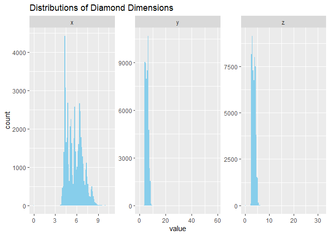
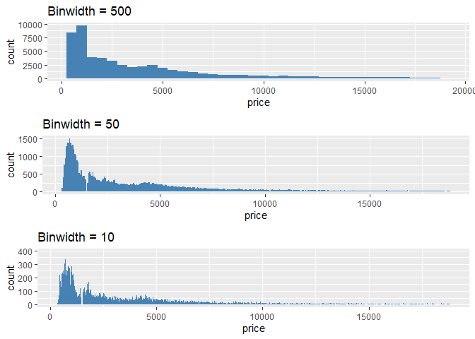
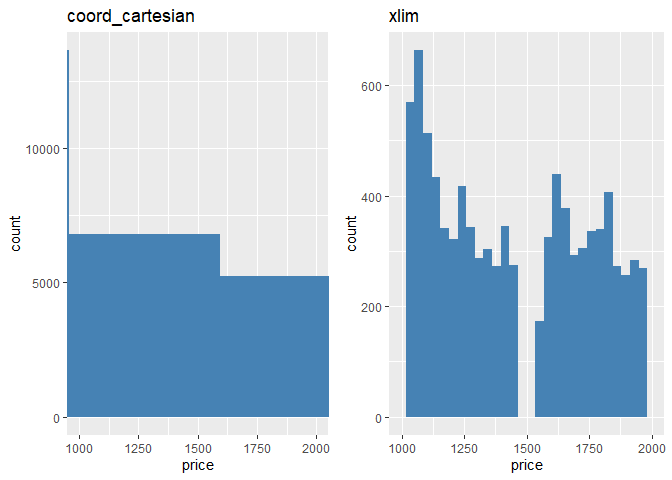
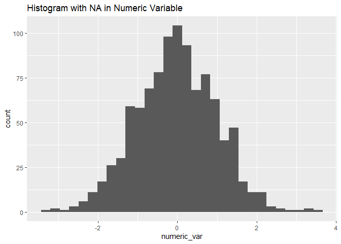
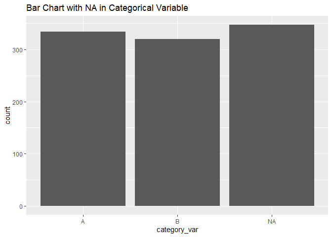
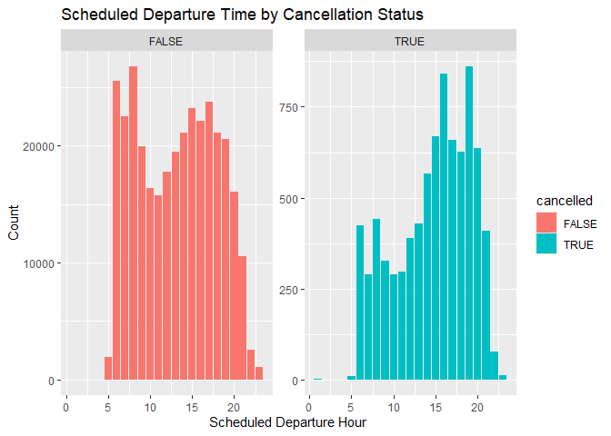

README
================

# 10.3.3 Exercises – Variation

## 1. Explore the distribution of each of the `x`, `y`, and `z` variables in `diamonds`. What do you learn? Think about a diamond and how you might decide which dimension is the length, width, and depth.

``` r
diamonds %>%
  select(x, y, z) %>%
  pivot_longer(cols = everything(), names_to = "dimension", values_to = "value") %>%
  ggplot(aes(x = value)) +
  geom_histogram(bins = 100, fill = "skyblue") +
  facet_wrap(~dimension, scales = "free") +
  labs(title = "Distributions of Diamond Dimensions")
```

<!-- -->

These distributions show most diamonds fall into a certain size range, but there are also clear outliers or errors (e.g., values near zero). A possible mapping could be: `x` as length, `y` as width, and `z` as depth, since `z` is usually smaller.

## 2. Explore the distribution of `price`. Do you discover anything unusual or surprising? (Hint: try a wide range of binwidths.)

``` r
# Binwidth = 500
p1 <- ggplot(diamonds, aes(x = price)) +
  geom_histogram(binwidth = 500, fill = "steelblue") +
  ggtitle("Binwidth = 500")

# Binwidth = 50
p2 <- ggplot(diamonds, aes(x = price)) +
  geom_histogram(binwidth = 50, fill = "steelblue") +
  ggtitle("Binwidth = 50")

# Binwidth = 10
p3 <- ggplot(diamonds, aes(x = price)) +
  geom_histogram(binwidth = 10, fill = "steelblue") +
  ggtitle("Binwidth = 10")

library(gridExtra)
```

    ## Warning: package 'gridExtra' was built under R version 4.3.3

    ## 
    ## Attaching package: 'gridExtra'

    ## The following object is masked from 'package:dplyr':
    ## 
    ##     combine

``` r
grid.arrange(p1, p2, p3, nrow = 3)
```

<!-- -->

When you reduce the binwidth, you begin to see strong spikes and dips, especially around round numbers like \$500, \$1000, etc. This suggests that price rounding or marketing strategies (like pricing just below \$1000) are common.

## 3. How many diamonds are 0.99 carat? How many are 1 carat? What do you think is the cause of the difference?

``` r
diamonds %>%
  filter(carat == 0.99 | carat == 1.00) %>%
  count(carat)
```

    ## # A tibble: 2 × 2
    ##   carat     n
    ##   <dbl> <int>
    ## 1  0.99    23
    ## 2  1     1558

There are far fewer diamonds at 0.99 carats than exactly 1.00 carat. This likely reflects consumer preference and pricing conventions: people may pay a premium for a “1 carat” stone, so manufacturers cut diamonds to just hit that mark.

## 4. Compare and contrast `coord_cartesian()` vs. `xlim()` or `ylim()` when zooming in on a histogram. What happens if you leave `binwidth` unset? What happens if you try and zoom so only half a bar shows?

``` r
# coord_cartesian
p1 <- ggplot(diamonds, aes(x = price)) +
  geom_histogram(fill = "steelblue") +
  coord_cartesian(xlim = c(1000, 2000)) +
  ggtitle("coord_cartesian")

# xlim
p2 <- ggplot(diamonds, aes(x = price)) +
  geom_histogram(fill = "steelblue") +
  xlim(1000, 2000) +
  ggtitle("xlim")

grid.arrange(p1, p2, nrow = 1)
```

    ## `stat_bin()` using `bins = 30`. Pick better value with `binwidth`.
    ## `stat_bin()` using `bins = 30`. Pick better value with `binwidth`.

    ## Warning: Removed 44232 rows containing non-finite outside the scale range
    ## (`stat_bin()`).

    ## Warning: Removed 2 rows containing missing values or values outside the scale range
    ## (`geom_bar()`).

<!-- -->

`coord_cartesian()` zooms in **without removing data**, while `xlim()` **filters the data**, changing the shape of the histogram. If you don’t set `binwidth`, ggplot will use a default that might not align with your zoom range. Zooming to a range where only half a bar shows can result in odd visuals or misleading bar heights.

# 10.4.1 Exercises – Missing Values

## 1. What happens to missing values in a histogram? What happens to missing values in a bar chart? Why is there a difference in how missing values are handled in histograms and bar charts?

``` r
# Add an NA value artificially for demonstration
set.seed(42)
demo_data <- tibble(
  numeric_var = c(rnorm(1000), NA),
  category_var = sample(c("A", "B", NA), 1001, replace = TRUE)
)

# Histogram
ggplot(demo_data, aes(x = numeric_var)) +
  geom_histogram() +
  ggtitle("Histogram with NA in Numeric Variable")
```

    ## `stat_bin()` using `bins = 30`. Pick better value with `binwidth`.

    ## Warning: Removed 1 row containing non-finite outside the scale range
    ## (`stat_bin()`).

<!-- -->

``` r
# Bar chart
ggplot(demo_data, aes(x = category_var)) +
  geom_bar() +
  ggtitle("Bar Chart with NA in Categorical Variable")
```

<!-- -->

In a **histogram**, missing values are silently dropped. In a **bar chart**, missing values show up as a bar labeled `<NA>`. This reflects how categorical data can have a defined missing label, but continuous variables simply omit `NA`s from the plot.

## 2. What does `na.rm = TRUE` do in `mean()` and `sum()`?

``` r
x <- c(1, 2, 3, NA, 5)
mean(x)        # NA
```

    ## [1] NA

``` r
mean(x, na.rm = TRUE)  # 2.75
```

    ## [1] 2.75

``` r
sum(x)         # NA
```

    ## [1] NA

``` r
sum(x, na.rm = TRUE)   # 11
```

    ## [1] 11

`na.rm = TRUE` tells the function to **remove missing values before computation**. Without it, the result is `NA`.

## 3. Recreate the frequency plot of `scheduled_dep_time` colored by whether the flight was cancelled or not. Also facet by the `cancelled` variable. Experiment with different values of the `scales` variable in the faceting function.

``` r
# Create a cancelled flag
flights_clean <- flights %>%
  mutate(cancelled = is.na(dep_time))

# Convert scheduled departure to hour of day
flights_clean <- flights_clean %>%
  mutate(dep_hour = sched_dep_time %/% 100)

# Faceted plot
ggplot(flights_clean, aes(x = dep_hour, fill = cancelled)) +
  geom_bar(position = "dodge") +
  facet_wrap(~cancelled, scales = "free_y") +
  labs(title = "Scheduled Departure Time by Cancellation Status",
       x = "Scheduled Departure Hour", y = "Count")
```

<!-- -->

Using `scales = "free_y"` in `facet_wrap()` helps avoid distortion caused by the much larger number of non-cancelled flights. The plots show different hourly trends for cancelled vs. non-cancelled flights.
